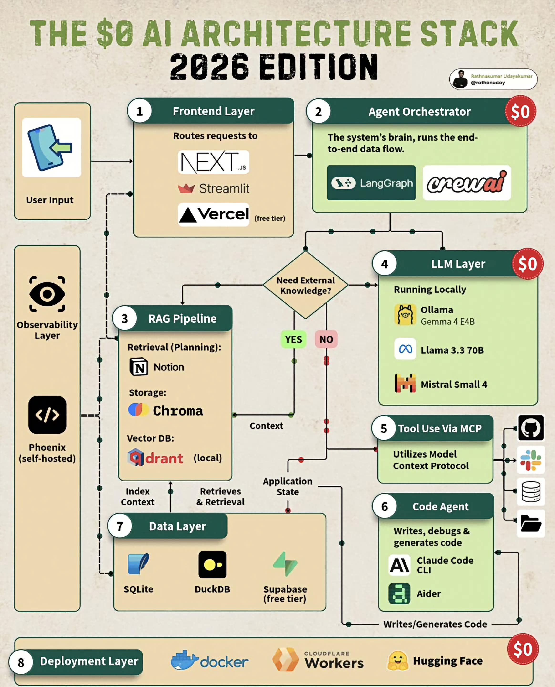

<!-- tags: vinkit, ai-ml -->

# $0 AI Architecture Stack 2026 (versio 2)

> Lähde: ulkoinen materiaali (tallennettu sosiaalisesta mediasta), ei sivuston omaa sisältöä.

Kaavio esittää täyden tekoälysovelluksen arkkitehtuurin, joka voidaan rakentaa kokonaan ilmaisilla tai ilmaisen tason (free tier) työkaluilla. Kuvassa on kahdeksan kerrosta, jotka yhdessä muodostavat päästä päähän -datavirran käyttäjän syötteestä valmiiseen vastaukseen.

## Kerrokset ja datavirta

1. **Frontend Layer** – käyttäjän syöte (User Input) reititetään sovelluksen käyttöliittymään. Esimerkkityökaluja: **Next.js**, **Streamlit**, **Vercel** (ilmainen taso hostaukseen).

2. **Agent Orchestrator** – järjestelmän "aivot", joka ajaa koko päästä päähän -datavirran. Käytännössä agenttien orkestrointikehykset kuten **LangGraph** ja **CrewAI** päättävät, mitä seuraavaksi tehdään.

3. Orkestraattori tekee päätöksen: **"Need External Knowledge?"** (tarvitaanko ulkoista tietoa?)
   - **YES** → pyyntö ohjataan **RAG Pipelineen** (kohta 3).
   - **NO** → pyyntö ohjataan suoraan **LLM Layeriin** (kohta 4).

3. **RAG Pipeline** (Retrieval-Augmented Generation) – haku- ja tiedonhakuputki:
   - **Retrieval (Planning):** Notion tietolähteenä/suunnitteluna.
   - **Storage:** Chroma.
   - **Vector DB:** Qdrant (paikallisesti ajettuna).
   
   RAG-putki hakee kontekstia ("Context") Data Layerista (indeksointi ja haku) ja palauttaa relevantin kontekstin orkestraattorille.

4. **LLM Layer** – paikallisesti ajettavat kielimallit, täysin ilmaiseksi: **Ollama** (Gemma 4 E4B), **Llama 3.3 70B**, **Mistral Small 4**.

5. **Tool Use Via MCP** – hyödyntää Model Context Protocolia (MCP) työkalujen käyttöön ulkoisten palveluiden kanssa (kuvassa symboloituna GitHub, Slack, tietokanta ja tiedostojärjestelmä -ikoneilla).

6. **Code Agent** – kirjoittaa, debuggaa ja generoi koodia. Työkaluina **Claude Code CLI** ja **Aider**. Koodiagentti kirjoittaa/generoi koodia, joka vaikuttaa sovelluksen tilaan (Application State).

7. **Data Layer** – pysyvä tallennus: **SQLite**, **DuckDB**, **Supabase** (ilmainen taso). Data Layer sekä indeksoi kontekstia RAG-putkeen että vastaanottaa/tarjoaa sovelluksen tilan (Application State) Code Agentille ja muille komponenteille.

8. **Deployment Layer** – julkaisu ja ajoympäristö, täysin ilmaiseksi: **Docker**, **Cloudflare Workers**, **Hugging Face**.

Lisäksi kaavion vasemmassa reunassa on **Observability Layer**, joka seuraa koko järjestelmää itse-hostatulla **Phoenix**-työkalulla (havainnointi/lokitus useasta kerroksesta: frontend, RAG-putki, data layer).

## Yhteenveto

Kaavio havainnollistaa, että nykyaikaisen agenttipohjaisen tekoälysovelluksen — mukaan lukien käyttöliittymä, orkestrointi, RAG, paikalliset kielimallit, työkalukäyttö MCP:n kautta, koodiagentti, datakerros, julkaisu ja havainnointi — voi rakentaa kokonaan ilmaisilla tai ilmaisen tason työkaluilla ilman pilvi-API-kustannuksia.
