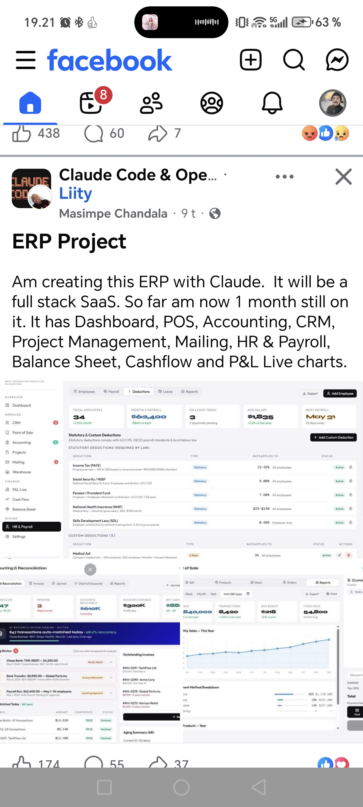

<!-- tags: vinkit, ai-ml -->

# ERP-järjestelmä rakennettuna Claude-tekoälyllä

> Lähde: ulkoinen materiaali (tallennettu sosiaalisesta mediasta), ei sivuston omaa sisältöä.

Facebook-julkaisussa kehittäjä kertoo rakentavansa täyden pinon (full stack) SaaS-tyyppistä ERP-järjestelmää Claude-tekoälyn avustuksella. Projekti on ollut työn alla noin kuukauden, ja siihen kuuluu useita moduuleja samassa sovelluksessa:

- **Dashboard** — yleisnäkymä liiketoiminnan tilaan
- **POS (Point of Sale)** — kassajärjestelmä myyntitapahtumille
- **Accounting** — kirjanpito ja tiliöinti
- **CRM** — asiakkuudenhallinta
- **Project Management** — projektinhallinta
- **Mailing** — viestintä/sähköpostitoiminnot
- **HR & Payroll** — henkilöstöhallinto ja palkanlaskenta
- **Balance Sheet** — tase
- **Cash Flow** — kassavirta
- **P&L (Profit & Loss)** — reaaliaikaiset tulos-/kannattavuuskaaviot

Kuvakaappauksista näkyy sovelluksen vasemman laidan navigaatio (Overview, Modules: CRM, Point of Sale, Accounting, Projects, Mailing, Warehouse; Finance: P&L Live, Cash Flow, Balance Sheet; System: HR & Payroll, Settings) — eli järjestelmä on rakennettu selkeästi moduloituna, kuten perinteiset ERP-tuotteet.

Näkyvissä olevat esimerkkinäkymät havainnollistavat kokonaisuutta:

- **HR & Payroll -näkymä**: työntekijämäärä, kuukausittainen palkkasumma, lomalla olevat, keskipalkka ja seuraava palkanmaksupäivä yhdellä silmäyksellä. Lisäksi lakisääteiset ja mukautetut palkkavähennykset (ennakonpidätys, sosiaaliturva, eläke, sairausvakuutus, koulutusmaksu) taulukkona statuksineen.
- **Accounting & Reconciliation -näkymä**: tekoälypohjainen tiliöinnin täsmäytysmoottori, joka on automaattisesti täsmännyt suuren osan päivän tapahtumista (esim. "647 transactions auto-matched today – 98.2% accuracy"), sekä lista täsmäytettävistä pankkitapahtumista ja avoimista laskuista.
- **Point of Sale -raporttinäkymä**: myyntiluvut ajanjaksolta (liikevaihto, tapahtumien määrä, keskiostos, myydyt tuotteet) ja kuukausittainen myyntikäyrä.

Kyseessä on siis esimerkki siitä, minkälaisia laajoja liiketoimintasovelluksia on mahdollista rakentaa tekoälyavusteisesti (Claude) ilman perinteistä suurta kehitystiimiä — hyvä referenssi omien AI-avusteisten projektien laajuuden hahmottamiseen.
