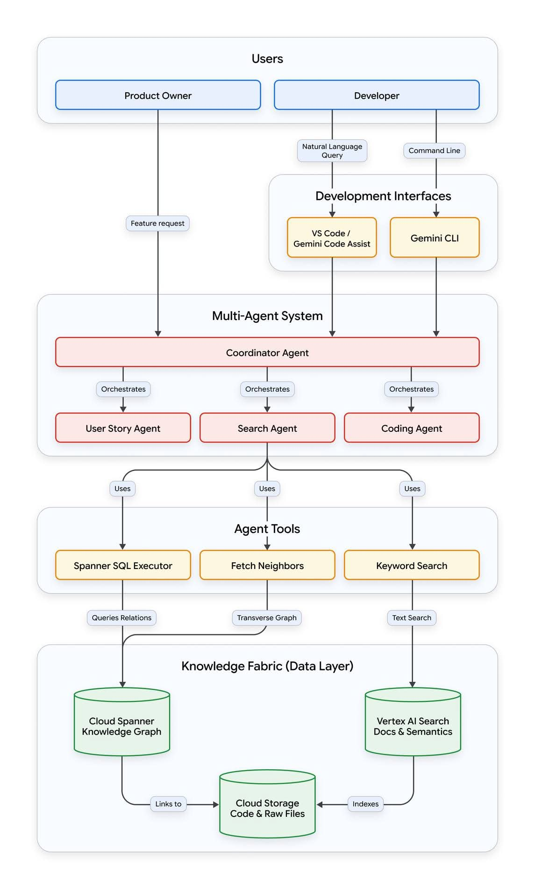

<!-- tags: vinkit, ai-ml -->

# Multi-agentti-AI-järjestelmän arkkitehtuurikaavio

> Lähde: ulkoinen materiaali (tallennettu sosiaalisesta mediasta), ei sivuston omaa sisältöä.

Kaavio kuvaa täyden pinon arkkitehtuurin, jossa useampi tekoälyagentti työskentelee yhdessä koodikannan ja tuotetiedon parissa. Rakenne etenee ylhäältä alas viitenä kerroksena.

## 1. Käyttäjät

Kaksi käyttäjäroolia käynnistää toiminnan: **Product Owner** ja **Developer**.

- Product Owner lähettää suoraan **feature requestin** (ominaisuuspyynnön) järjestelmän koordinaattorille.
- Developer voi käyttää joko luonnollisen kielen kyselyä tai komentorivi­työkalua.

## 2. Kehitysrajapinnat (Development Interfaces)

Developerin pyynnöt kulkevat kahden rajapinnan kautta:

- **VS Code / Gemini Code Assist** – vastaanottaa luonnollisen kielen kyselyn (Natural Language Query).
- **Gemini CLI** – vastaanottaa komentorivikomennot (Command Line).

Molemmat rajapinnat välittävät pyynnön eteenpäin multi-agenttijärjestelmälle.

## 3. Multi-agenttijärjestelmä

Kaikki kolme tulovirtaa (Product Ownerin feature request sekä Developerin kaksi kanavaa) päätyvät **Coordinator Agentille**, joka orkestroi kolmea erikoistunutta alaagenttia:

- **User Story Agent** – käyttäjätarinoiden käsittely
- **Search Agent** – tiedonhaku
- **Coding Agent** – koodin kirjoittaminen/muokkaus

## 4. Agenttityökalut (Agent Tools)

Search Agent (ja tarvittaessa muut agentit) käyttävät kolmea työkalua tiedon hakemiseen:

- **Spanner SQL Executor** – suorittaa SQL-kyselyitä relaatiotietoon ("Queries Relations")
- **Fetch Neighbors** – kulkee tietograafia läpi ("Transverse Graph")
- **Keyword Search** – tekee tekstihakuja ("Text Search")

## 5. Tietopohja (Knowledge Fabric / Data Layer)

Työkalut hakevat dataa kolmesta varastosta:

- **Cloud Spanner Knowledge Graph** – relaatio- ja graafimuotoinen tietograafi, johon Spanner SQL Executor ja Fetch Neighbors kohdistuvat.
- **Vertex AI Search (Docs & Semantics)** – dokumentaatio- ja semanttinen haku, johon Keyword Search kohdistuu.
- **Cloud Storage (Code & Raw Files)** – varsinainen koodi ja raakatiedostot. Knowledge Graph "linkittyy" tähän varastoon, ja Vertex AI Search "indeksoi" sen.

## Kokonaiskuva

Arkkitehtuuri näyttää, miten käyttöliittymätason pyynnöt (luonnollinen kieli tai komentorivi) muunnetaan koordinoiduksi agenttityöksi, joka hakee tarvitsemansa tiedon strukturoidusta tietograafista, semanttisesta hakuindeksistä ja raakakooditiedostoista – yhdistäen relaatiodatan, semanttisen haun ja tiedostovaraston yhdeksi agenttien käytettäväksi tietopohjaksi.
