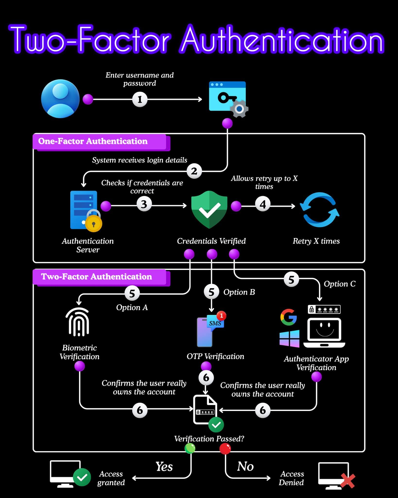

<!-- tags: vinkit, backend-api -->

# Kaksivaiheisen tunnistautumisen (2FA) vuokaavio

> Lähde: ulkoinen materiaali (tallennettu sosiaalisesta mediasta), ei sivuston omaa sisältöä.

Kaavio näyttää koko kirjautumisprosessin kulun yhden tekijän tunnistautumisesta (1FA) kaksivaiheiseen tunnistautumiseen (2FA) asti, numeroituna vaiheittain.

## Yhden tekijän tunnistautuminen (One-Factor Authentication)

1. Käyttäjä syöttää käyttäjätunnuksen ja salasanan.
2. Järjestelmä vastaanottaa kirjautumistiedot.
3. Todennuspalvelin (Authentication Server) tarkistaa, ovatko tunnukset oikein.
4. Jos tunnukset eivät täsmää, käyttäjä saa yrittää uudelleen enintään X kertaa ("Retry X times").

Kun tunnukset (credentials) on varmennettu ("Credentials Verified"), prosessi jatkuu kaksivaiheiseen tunnistautumiseen.

## Kaksivaiheinen tunnistautuminen (Two-Factor Authentication)

Vaiheessa 5 käyttäjä valitsee (tai järjestelmä vaatii) yhden kolmesta lisävarmennustavasta:

- **Vaihtoehto A – Biometrinen varmennus:** esim. sormenjälki.
- **Vaihtoehto B – OTP-varmennus:** kertakäyttöinen koodi tekstiviestillä (SMS) puhelimeen.
- **Vaihtoehto C – Autentikaattorisovellus:** esim. Google- tai Microsoft-autentikaattorisovellus, joka generoi kertakäyttöisen koodin.

Vaiheessa 6 valittu menetelmä vahvistaa, että käyttäjä todella omistaa tilin ("Confirms the user really owns the account"), ja järjestelmä tarkistaa, menikökö varmennus läpi ("Verification Passed?").

- **Kyllä (Yes):** pääsy myönnetään (Access granted).
- **Ei (No):** pääsy evätään (Access Denied).

## Miksi tämä on tärkeää

2FA lisää turvallisuuden ylimääräisellä kerroksella: pelkkä salasanan vuotaminen ei riitä hyökkääjälle tilin haltuunottoon, koska hän tarvitsisi myös toisen tekijän (esim. käyttäjän puhelimen tai sormenjäljen). Kolme yleisintä toteutustapaa — biometriikka, SMS/OTP ja autentikaattorisovellus — eroavat käyttömukavuudeltaan ja turvallisuustasoltaan, ja monet järjestelmät tarjoavat käyttäjälle valinnan niiden välillä.
