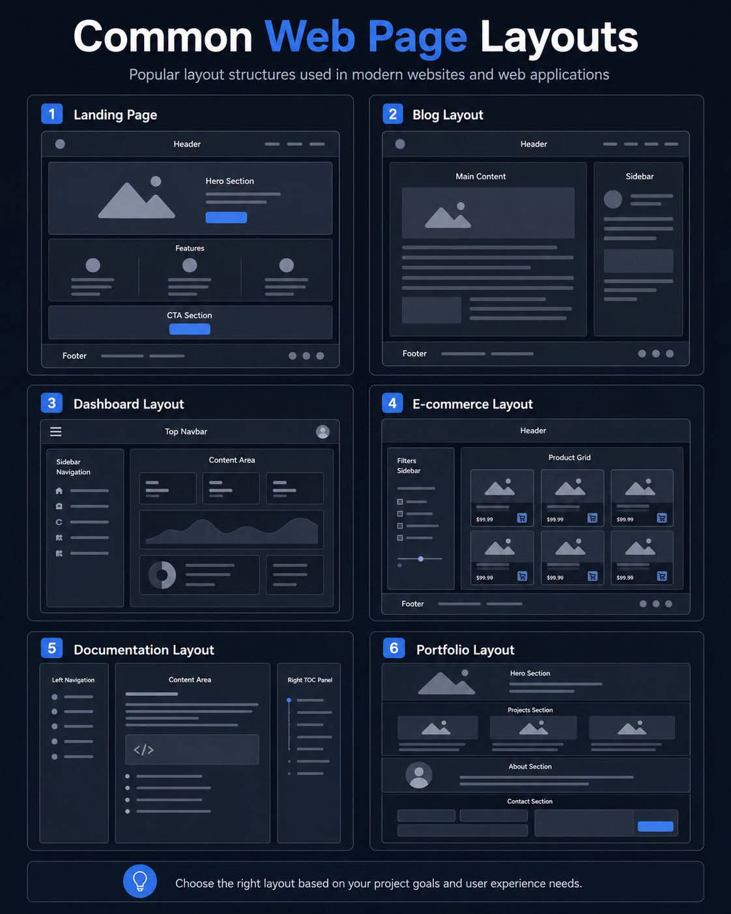

<!-- tags: vinkit, html-css -->

# Yleisimmät verkkosivujen layout-rakenteet

> Lähde: ulkoinen materiaali (tallennettu sosiaalisesta mediasta), ei sivuston omaa sisältöä.

Kokoelma kuudesta modernien verkkosivustojen ja -sovellusten suosituimmasta layout-rakenteesta rautalankamalleina (wireframe). Kuva on säilytetty sellaisenaan, koska visuaalinen layout-rakenne (elementtien sijoittelu ja mittasuhteet) on juuri se asia, jota kuvataan — se ei välity tekstinä yhtä hyvin. Alla selitys kustakin rakenteesta.

## 1. Landing Page

Header ylhäällä navigointilinkkeineen. Sen alla Hero-osio, jossa on kuva/visuaali, otsikkoteksti ja toimintakehotus-painike (CTA). Seuraavaksi Features-osio kolmella pylväällä (ikoni + teksti kussakin). Lopussa erillinen CTA-osio ja footer. Tyypillinen rakenne markkinointisivuille ja tuotesivuille.

## 2. Blog Layout

Header ylhäällä. Pääsisältöalue (Main Content) vasemmalla — sisältää kuvan ja tekstikappaleita — ja kapeampi sivupalkki (Sidebar) oikealla lisäsisällölle (esim. suositellut artikkelit, kategoriat). Footer alhaalla.

## 3. Dashboard Layout

Ylhäällä Top Navbar. Vasemmalla kapea Sidebar Navigation -valikko ikoneineen. Oikealla laaja Content Area, joka sisältää tietokortteja, kaavion (esim. viivakaavio) sekä donitsikaavion ja lisätietolaatikoita. Tyypillinen admin-paneelien ja hallintasovellusten rakenne.

## 4. E-commerce Layout

Header ylhäällä. Vasemmalla Filters Sidebar (suodattimet). Oikealla Product Grid — ruudukko tuotekorteista, joissa kuva, hinta ja ostoskori-painike. Footer alhaalla.

## 5. Documentation Layout

Kolme palstaa: vasemmalla Left Navigation (sisällysluettelo-tyyppinen valikko), keskellä Content Area koodilohkoineen, ja oikealla Right TOC Panel (sivun sisäinen sisällysluettelo pikanavigointia varten).

## 6. Portfolio Layout

Hero-osio ylhäällä. Sen alla Projects-osio ruudukkona (kuvakortit). Seuraavaksi About-osio profiilikuvalla ja tekstillä. Lopussa Contact-osio yhteydenottolomakkeella.

## Yhteenveto

Oikean layoutin valinta riippuu projektin tavoitteista ja käyttökokemustarpeista — esimerkiksi dashboard-rakenne sopii datavetoisiin hallintasovelluksiin, kun taas landing page -rakenne sopii markkinointiin ja konversioon tähtääville sivuille.
