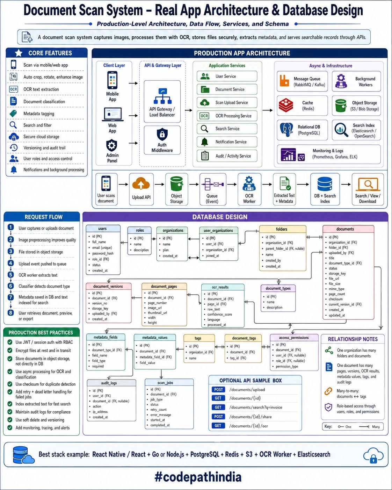

<!-- tags: vinkit, jarjestelmasuunnittelu -->

# Dokumenttien skannausjärjestelmän arkkitehtuuri ja tietokantasuunnittelu

> Lähde: ulkoinen materiaali (tallennettu sosiaalisesta mediasta), ei sivuston omaa sisältöä.



Dokumenttien skannausjärjestelmä kuvaa dokumentteja mobiili- tai web-sovelluksella, käsittelee ne OCR:llä, tallentaa tiedostot turvallisesti, poimii metadatan ja tarjoaa hakukelpoiset tietueet API:en kautta. Kuva sisältää sekä sovellusarkkitehtuurin että tietokantaskeeman, joten se on säilytetty kuvana kokonaisuuden hahmottamiseksi — alla selitys ja tekstiksi puretut osat.

## Ydinominaisuudet

- Skannaus mobiili-/web-sovelluksella
- Kuvan automaattinen rajaus, kierto ja parannus
- OCR-tekstintunnistus
- Dokumenttien luokittelu
- Metadatan tägäys
- Haku ja suodatus
- Turvallinen pilvitallennus
- Versiointi ja audit trail
- Käyttäjäroolit ja pääsynhallinta
- Ilmoitukset ja taustaprosessointi

## Sovellusarkkitehtuuri (kerrokset)

- **Client Layer:** Mobile App, Web App, Admin Panel
- **API & Gateway Layer:** API Gateway / Load Balancer, Auth Middleware
- **Application Services:** User Service, Document Service, Scan Upload Service, OCR Processing Service, Search Service, Notification Service, Audit/Activity Service
- **Async & Infrastructure:** Message Queue (RabbitMQ/Kafka), Background Workers, Cache (Redis), Object Storage (S3/Blob Storage), Relational DB (PostgreSQL), Search Index (Elasticsearch/OpenSearch), Monitoring & Logs (Prometheus, Grafana, ELK)

Datavirta yläpalkissa: `User scans document → Upload API → Object Storage → Queue (Event) → OCR Worker → Extracted Text + Metadata → DB + Search Index → Search / View / Download`

## Pyynnön kulku (Request Flow)

1. Käyttäjä kuvaa tai lataa dokumentin.
2. Kuvan esikäsittely parantaa laatua.
3. Tiedosto tallennetaan object storageen.
4. Latauseventti työnnetään jonoon.
5. OCR-worker poimii tekstin.
6. Luokitin tunnistaa dokumenttityypin.
7. Metadata tallennetaan tietokantaan ja teksti indeksoidaan hakua varten.
8. Käyttäjä hakee, esikatselee tai lataa dokumentin.

## Tietokantaskeema (pääkohdat)

Keskeiset taulut: `users`, `roles`, `organizations`, `user_organizations`, `folders`, `documents`, `document_versions`, `document_pages`, `ocr_results`, `document_types`, `metadata_fields`, `metadata_values`, `tags`, `document_tags`, `access_permissions`, `audit_logs`, `scan_jobs`.

**Suhteiden pääperiaatteet:**
- Yhdellä organisaatiolla on monta kansiota ja dokumenttia.
- Yhdellä dokumentilla on monta sivua, versiota, OCR-tulosta, metadata-arvoa, tagia ja audit-lokia.
- Dokumenttien ja tagien välillä on monta-moneen-suhde.
- Roolipohjainen pääsynhallinta käyttäjien, roolien ja lupien kautta.

## Esimerkki-API-päätepisteet

```
POST /documents/upload
GET  /documents/{id}
GET  /documents/search?q=invoice
POST /documents/{id}/share
GET  /documents/{id}/ocr
```

## Tuotantotason parhaat käytännöt

- Käytä JWT/session-autentikaatiota roolipohjaisella pääsynhallinnalla (RBAC)
- Salaa tiedostot levossa ja siirron aikana
- Tallenna dokumentit object storageen, ei suoraan tietokantaan
- Käytä asynkronista prosessointia OCR:lle ja luokittelulle
- Käytä checksumia duplikaattien tunnistukseen
- Lisää uudelleenyritys ja dead-letter-käsittely epäonnistuneille töille
- Indeksoi poimittu teksti nopeaa hakua varten
- Ylläpidä audit-lokeja vaatimustenmukaisuutta varten
- Käytä pehmeää poistoa (soft delete) ja versiointia
- Lisää monitorointi, jäljitys ja hälytykset

## Esimerkki teknologiapinosta

React Native / React + Go tai Node.js + PostgreSQL + Redis + S3 + OCR Worker + Elasticsearch
