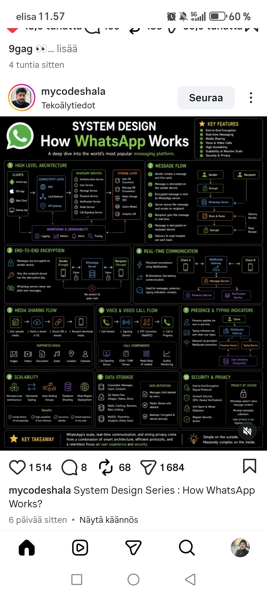

<!-- tags: vinkit, jarjestelmasuunnittelu -->

# Järjestelmäsuunnittelu: miten WhatsApp toimii

> Lähde: ulkoinen materiaali (tallennettu sosiaalisesta mediasta), ei sivuston omaa sisältöä.

Kymmenosainen kaavio, joka esittelee WhatsAppin kaltaisen massiivisen viestintäjärjestelmän arkkitehtuurin keskeiset osa-alueet.

## Avainominaisuudet

Päästä-päähän-salaus, reaaliaikainen viestintä, median jakaminen, ääni- ja videopuhelut, korkea saatavuus, skaalautuvuus massiiviseen mittakaavaan, tietoturva ja yksityisyys.

## 1. Ylätason arkkitehtuuri

Asiakassovellukset (Android, iOS, web, desktop) ottavat yhteyden yhdyskäytäväkerrokseen (DNS, kuormantasaaja, API-yhdyskäytävä). Tämän takana on joukko palveluita: autentikointi, käyttäjäpalvelu, viestipalvelu, läsnäolopalvelu, ilmoituspalvelu, mediapalvelu ja puhelujen signalointipalvelu. Tallennuskerroksessa on erilliset tietokannat käyttäjille ja viesteille (Cassandra), mediatallennus (S3), välimuisti (Redis) ja analytiikkatietokanta. Koko järjestelmää valvotaan lokituksella, mittareilla, hälytyksillä ja jäljityksellä (monitoring & observability).

## 2. Viestin kulku

Lähettäjä luo viestin, joka salataan jo lähettäjän laitteella ennen kuin se lähetetään WhatsAppin palvelimelle. Palvelin tallentaa ja reitittää viestin, vastaanottaja saa sen reaaliajassa ja purkaa salauksen omalla laitteellaan. Toimitus- ja lukukuittaukset lähetetään takaisin lähettäjälle.

## 3. Päästä-päähän-salaus

Viestit salataan jo lähettäjän laitteella, ja vain vastaanottajan laitteella on purkuavain. WhatsAppin palvelimet eivät koskaan näe selväkielistä (plain text) sisältöä – palvelin toimii vain salatun datan (cipher) välittäjänä, eikä sillä ole pääsyä itse viestin sisältöön.

## 4. Reaaliaikainen viestintä

Pysyvät yhteydet toteutetaan WebSocketeilla kaksisuuntaisen, matalan viiveen kommunikoinnin mahdollistamiseksi. WebSocket-yhdyskäytävän kautta kulkevat viestit, läsnäolotieto, kirjoitusindikaattorit ja kuittaukset asiakkaiden (Client A, Client B) välillä, viesti- ja ilmoituspalveluiden tukemana.

## 5. Median jakaminen

Käyttäjä lataa median, joka tallennetaan S3:een, minkä jälkeen jaetaan suojattu URL vastaanottajalle, joka lataa median. Tuettuja mediatyyppejä ovat kuvat, videot, dokumentit, ääni, sijainti ja yhteystiedot.

## 6. Ääni- ja videopuhelut

Puhelu alustetaan, signalointi hoidetaan palvelimen kautta, minkä jälkeen muodostetaan suora P2P-yhteys (WebRTC) ja puhelu on käynnissä. Puhelun komponentteja ovat signalointipalvelu, STUN/TURN-palvelimet, mediarelepalvelimet (tarvittaessa) sekä laadunvalvonta.

## 7. Läsnäolo ja kirjoitusindikaattorit

Läsnäolopäivitykset lähetetään reaaliajassa ja kirjoitusindikaattorit näytetään käyttäjän kirjoittaessa. Tieto kulkee pysyvän WebSocket-yhteyden kautta läsnäolo- ja kirjoituspalveluiden sekä käyttäjähakemiston (Cassandra) välillä.

## 8. Skaalautuvuus

Mikropalveluarkkitehtuuri, horisontaalinen skaalaus, automaattiset skaalausryhmät, tietokannan sharding ja monialueellinen (multi-region) käyttöönotto mahdollistavat miljardien päivittäisten viestien käsittelyn, korkean saatavuuden, matalan viiveen ja sujuvan käyttökokemuksen missä tahansa mittakaavassa.

## 9. Datan tallennus

Cassandra tallentaa viestit, käyttäjät ja yhteystiedot. S3 tallentaa mediatiedostot. Redis vastaa välimuistista, istunnoista ja pyyntömäärien rajoittamisesta. MySQL tallentaa maksut ja analytiikkadatan (meta data). Datan säilytys: viestit poistetaan käyttäjän toimesta, media säilyy poistoon asti, varmuuskopiot on salattu ja tallennettu turvallisesti.

## 10. Tietoturva ja yksityisyys

Päästä-päähän-salaus (Signal-protokolla), tilin suojaus (2FA, laitteen vahvistus), roskapostin ja väärinkäytön tunnistus sekä säännölliset tietoturva-auditoinnit. WhatsApp ei tallenna viestien sisältöä, kerää vain minimaalista metadataa, ja käyttäjän yksityisyys on ensisijainen periaate.

## Ydinviesti

WhatsAppin mittakaava, reaaliaikainen viestintä ja vahva yksityisyys perustuvat älykkään arkkitehtuurin, tehokkaiden protokollien sekä käyttökokemukseen ja tietoturvaan keskittymisen yhdistelmään: yksinkertainen ulkoapäin, valtavan monimutkainen sisältä.
