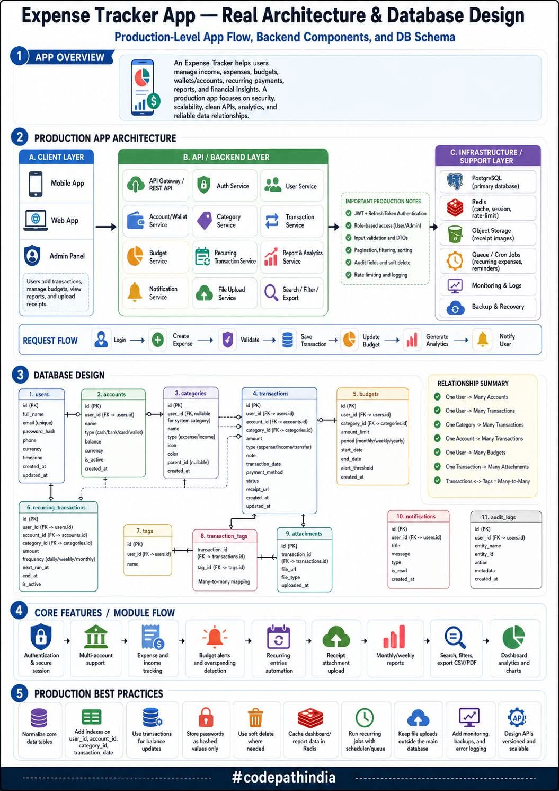

<!-- tags: vinkit, jarjestelmasuunnittelu -->

# Kulunseurantasovelluksen arkkitehtuuri ja tietokantasuunnittelu

> Lähde: ulkoinen materiaali (tallennettu sosiaalisesta mediasta), ei sivuston omaa sisältöä.



Kulunseurantasovellus (Expense Tracker) auttaa käyttäjiä hallitsemaan tuloja, menoja, budjetteja, lompakoita/tilejä, toistuvia maksuja, raportteja ja taloudellisia näkymiä. Tuotantotason sovellus keskittyy turvallisuuteen, skaalautuvuuteen, siisteihin API:hin, analytiikkaan ja luotettaviin datasuhteisiin. Kuva on säilytetty kokonaisuudessaan, koska se sisältää sekä arkkitehtuurikaavion että tietokantaskeeman — alla selitys ja tekstiksi puretut osat.

## Sovellusarkkitehtuuri

- **A. Client Layer:** Mobile App, Web App, Admin Panel — käyttäjät lisäävät kuluja, hallitsevat budjetteja, katsovat raportteja ja lataavat kuitteja.
- **B. API / Backend Layer:** API Gateway/REST API, Auth Service, User Service, Account/Wallet Service, Category Service, Transaction Service, Budget Service, Recurring Transaction Service, Report & Analytics Service, Notification Service, File Upload Service, Search/Filter/Export.
- **C. Infrastructure / Support Layer:** PostgreSQL (pääasiallinen tietokanta), Redis (cache, sessio, rate-limit), Object Storage (kuitit), Queue/Cron Jobs (toistuvat kulut, muistutukset), Monitoring & Logs, Backup & Recovery.

**Tärkeitä tuotantohuomioita:** JWT + refresh-token-autentikaatio, roolipohjainen pääsy (käyttäjä/admin), syötteiden validointi ja DTO:t, sivutus/suodatus/järjestäminen, audit-kentät ja pehmeä poisto, rate limiting ja lokitus.

## Pyynnön kulku

```
Login → Create Expense → Validate → Save Transaction → Update Budget → Generate Analytics → Notify User
```

## Tietokantaskeema (pääkohdat)

Taulut: `users`, `accounts`, `categories`, `transactions`, `budgets`, `recurring_transactions`, `tags`, `transaction_tags`, `attachments`, `notifications`, `audit_logs`.

**Suhteet:**
- Yksi käyttäjä → monta tiliä, transaktiota, budjettia
- Yksi kategoria → monta transaktiota
- Yksi tili → monta transaktiota
- Yksi transaktio → monta liitettä (attachments)
- Transaktiot ja tagit ovat monta-moneen-suhteessa

## Ydinominaisuudet / moduulien kulku

Autentikaatio ja turvallinen sessio → useiden tilien tuki → tulojen ja menojen seuranta → budjettihälytykset ja ylikulutuksen tunnistus → toistuvien merkintöjen automaatio → kuittien liitteiden lataus → kuukausi-/viikkoraportit → haku ja suodattimet, CSV/PDF-vienti → dashboard-analytiikka ja kaaviot.

## Tuotantotason parhaat käytännöt

- Normalisoi ydintietotaulut
- Lisää indeksit `user_id`, `account_id`, `category_id`, `transaction_date` -kentille
- Käytä transaktioita saldopäivityksiin
- Tallenna salasanat vain hajautettuina (hashed)
- Käytä pehmeää poistoa tarvittaessa
- Välimuistita dashboard-/raporttidata Redisiin
- Aja toistuvat työt schedulerilla/jonolla
- Pidä tiedostolataukset erillään pääkannasta
- Lisää monitorointi, varmuuskopiot ja virhelokitus
- Suunnittele API:t versioidusti ja skaalautuviksi
