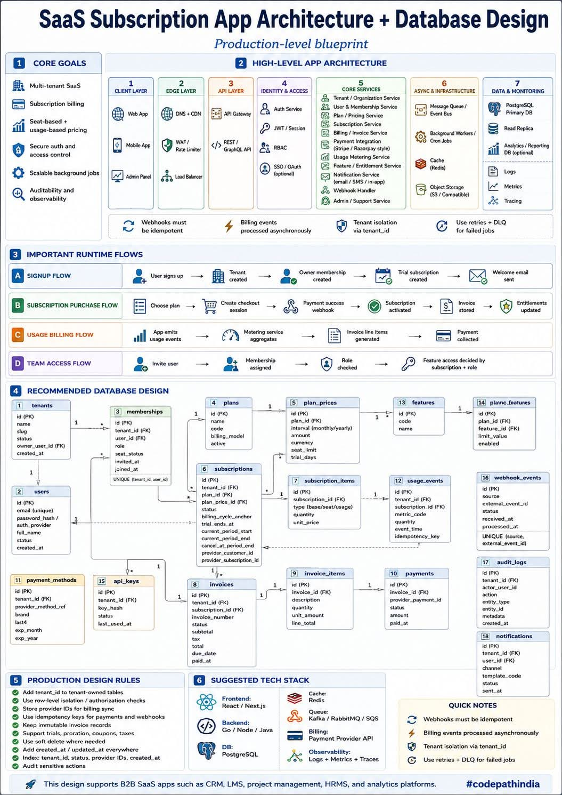

<!-- tags: vinkit, jarjestelmasuunnittelu -->

# SaaS-tilaussovelluksen arkkitehtuuri ja tietokantasuunnittelu

> Lähde: ulkoinen materiaali (tallennettu sosiaalisesta mediasta), ei sivuston omaa sisältöä.

Tuotantotason blueprint monivuokralaiselle (multi-tenant) SaaS-tilaussovellukselle: laskutus, käyttöoikeudet, tilaukset ja skaalautuva taustainfrastruktuuri. Kuva on säilytetty kokonaisuudessaan monimutkaisen arkkitehtuurin ja laajan tietokantaskeeman vuoksi — alla selitys ja tekstiksi puretut osat.

## Ydintavoitteet

- Monivuokralainen (multi-tenant) SaaS
- Tilauslaskutus (subscription billing)
- Paikka- ja käyttöperusteinen hinnoittelu (seat-based + usage-based pricing)
- Turvallinen autentikaatio ja pääsynhallinta
- Skaalautuvat taustatyöt
- Auditoitavuus ja havainnoitavuus (observability)

## Korkean tason arkkitehtuuri

1. **Client Layer:** Web App, Mobile App, Admin Panel
2. **Edge Layer:** DNS + CDN, WAF / Rate Limiter, Load Balancer
3. **API Layer:** API Gateway, REST / GraphQL API
4. **Identity & Access:** Auth Service, JWT / Session, RBAC, SSO/OAuth (valinnainen)
5. **Core Services:** Tenant/Organization Service, User & Membership Service, Plan/Pricing Service, Subscription Service, Billing/Invoice Service, Payment Integration (esim. Stripe/Razorpay-tyylinen), Usage Metering Service, Feature/Entitlement Service, Notification Service (email/SMS/in-app), Webhook Handler, Admin/Support Service
6. **Async & Infrastructure:** Message Queue/Event Bus, Background Workers/Cron Jobs, Cache (Redis), Object Storage (S3-yhteensopiva)
7. **Data & Monitoring:** PostgreSQL (pääkanta), Read Replica, Analytics/Reporting DB (valinnainen), Logs, Metrics, Tracing

**Tärkeät säännöt:** webhookien tulee olla idempotentteja, laskutustapahtumat käsitellään asynkronisesti, vuokralaisten eristys (tenant isolation) `tenant_id`:n kautta, uudelleenyritykset + dead-letter-queue epäonnistuneille töille.

## Tärkeimmät ajonaikaiset kulut

- **Signup Flow:** Käyttäjä rekisteröityy → Tenant luodaan → Owner-jäsenyys luodaan → Kokeilutilaus (trial) luodaan → Tervetuloviesti lähetetään.
- **Subscription Purchase Flow:** Valitse paketti → Luo checkout-sessio → Maksu onnistuu (webhook) → Tilaus aktivoidaan → Lasku tallennetaan → Käyttöoikeudet päivitetään.
- **Usage Billing Flow:** Sovellus lähettää käyttötapahtumia → Mittauspalvelu (metering) aggregoi → Laskurivit generoidaan → Maksu peritään.
- **Team Access Flow:** Kutsu käyttäjä → Jäsenyys osoitetaan → Rooli tarkistetaan → Ominaisuuksien käyttöoikeus päätetään tilauksen ja roolin perusteella.

## Tietokantaskeema (pääkohdat)

Taulut: `tenants`, `users`, `memberships`, `plans`, `plan_prices`, `subscriptions`, `subscription_items`, `invoices`, `invoice_items`, `payments`, `payment_methods`, `usage_events`, `features`, `plan_features`, `api_keys`, `webhook_events`, `audit_logs`, `notifications`.

## Tuotantosuunnittelun säännöt

- Lisää `tenant_id` kaikkiin vuokralaiskohtaisiin tauluihin
- Käytä rivitason eristystä / lupatarkistuksia
- Tallenna maksupalveluntarjoajan tunnisteet laskutuksen synkronointia varten
- Käytä idempotenssiavaimia maksuille ja webhookeille
- Pidä laskut muuttumattomina (immutable)
- Tue kokeiluja, suhteutusta (proration), kuponkeja ja veroja
- Käytä pehmeää poistoa tarvittaessa
- Lisää `created_at`/`updated_at` kaikkialle
- Indeksoi `tenant_id`, status, tarjoajan tunnisteet, `created_at`
- Auditoi arkaluontoiset toimet

## Ehdotettu teknologiapino

- **Frontend:** React/Next.js
- **Backend:** Go/Node/Java
- **DB:** PostgreSQL
- **Cache:** Redis
- **Queue:** Kafka/RabbitMQ/SQS
- **Billing:** Payment Provider API
- **Observability:** Logs + Metrics + Traces

Tämä suunnittelu sopii B2B SaaS -sovelluksiin kuten CRM, LMS, projektinhallinta, HRMS ja analytiikka-alustat.
