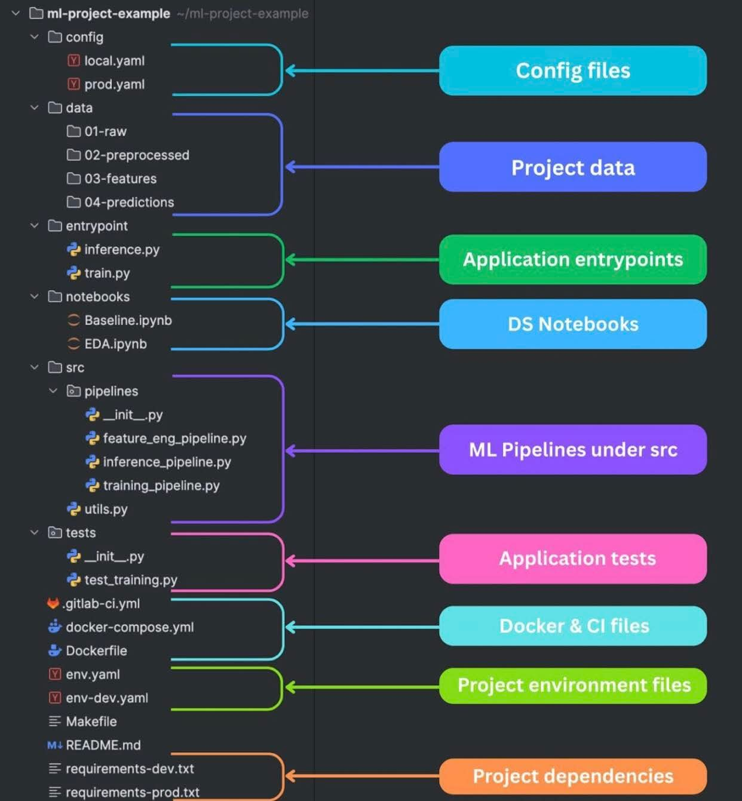

<!-- tags: vinkit, projekti-ideat -->

# ML-projektin kansiorakennekaavio

> Lähde: ulkoinen materiaali (tallennettu sosiaalisesta mediasta), ei sivuston omaa sisältöä.

Kaavio näyttää esimerkin (`ml-project-example`) hyvin jäsennellystä koneoppimisprojektin kansiorakenteesta, ja jokainen osa on selitetty värikoodatulla nuolella.

## Rakenteen osat

- **`config/`** — konfiguraatiotiedostot (`local.yaml`, `prod.yaml`): erilliset asetukset paikalliseen kehitykseen ja tuotantoon.
- **`data/`** — projektin data, jaettu vaiheittain: `01-raw` (raakadata), `02-preprocessed` (esikäsitelty data), `03-features` (piirteet), `04-predictions` (ennusteet). Tämä nelivaiheinen jako tekee data-putken vaiheista selkeät ja jäljitettävät.
- **`entrypoint/`** — sovelluksen käynnistyspisteet: `inference.py` (ennustuksen ajo) ja `train.py` (mallin koulutuksen ajo). Nämä ovat komentoja, joilla projektia oikeasti käytetään.
- **`notebooks/`** — data science -muistikirjat: `Baseline.ipynb` (perusmalli/vertailukohta) ja `EDA.ipynb` (eksploratiivinen data-analyysi). Muistikirjat on eriytetty tuotantokoodista.
- **`src/pipelines/`** — ML-putket varsinaisen sovelluslogiikan alla: `feature_eng_pipeline.py` (piirteiden generointi), `inference_pipeline.py` (ennustusputki) ja `training_pipeline.py` (koulutusputki), lisäksi `utils.py` apufunktioille. Tämä erottaa uudelleenkäytettävän putkilogiikan entrypoint-skripteistä.
- **`tests/`** — sovelluksen testit, esim. `test_training.py`.
- **Docker & CI -tiedostot** — `.gitlab-ci.yml`, `docker-compose.yml`, `Dockerfile`: jatkuvan integraation ja konttien ajamisen määrittelyt.
- **Ympäristötiedostot** — `env.yaml`, `env-dev.yaml`: riippuvuuksien/ympäristön kuvaukset esim. condalle.
- **Muut juuritason tiedostot** — `Makefile` (komentojen automatisointi), `README.md` (dokumentaatio), `requirements-dev.txt` ja `requirements-prod.txt` (projektin riippuvuudet erikseen kehitykseen ja tuotantoon).

## Miksi tällainen rakenne on hyvä

Rakenne erottaa selkeästi toisistaan: raakadatan ja käsitellyn datan, tutkimusvaiheen muistikirjat ja tuotantokelpoisen putkikoodin, sekä kehitys- ja tuotantoympäristöjen konfiguraatiot ja riippuvuudet. Tämä tekee projektista helpommin ylläpidettävän, testattavan ja monistettavan tiiminä, ja on hyvä lähtökohta oman ML-projektin pohjaksi.
