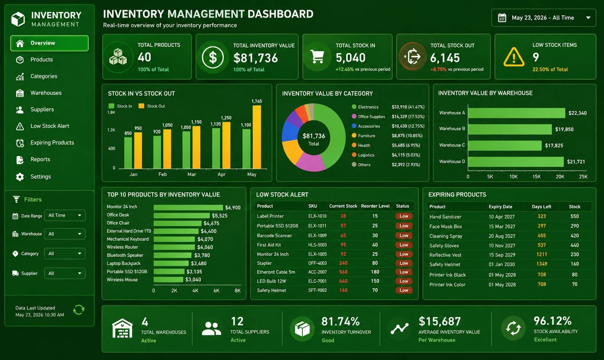

<!-- tags: vinkit, projekti-ideat -->

# Varastonhallinnan dashboard -esimerkki (dev-projektin UI)

> Lähde: ulkoinen materiaali (tallennettu sosiaalisesta mediasta), ei sivuston omaa sisältöä.

Kuvakaappaus on esimerkki siitä, miltä varastonhallintasovelluksen (inventory management) dashboard voi näyttää — hyvä referenssi omaan admin-paneeli- tai dashboard-projektiin.

## Näkymän rakenne

Vasemmalla on sivunavigaatio: Overview, Products, Categories, Warehouses, Suppliers, Low Stock Alert, Expiring Products, Reports, Settings — eli tyypillinen CRUD-hallintasovelluksen valikkorakenne, jossa jokainen kohde vastaa omaa entiteettiään (tuotteet, varastot, toimittajat).

Yläosassa on viisi tunnuslukukorttia (KPI-kortit):
- Total Products (tuotteiden kokonaismäärä)
- Total Inventory Value (varaston kokonaisarvo dollareissa)
- Total Stock In / Stock Out (saapunut/lähtenyt varasto, muutosprosentti edelliseen jaksoon verrattuna)
- Low Stock Items (vähissä olevat tuotteet, prosenttiosuus kokonaismäärästä)

## Visualisoinnit

- **Stock In vs Stock Out** -pylväskaavio kuukausittain (Jan–May), joka näyttää varaston liikkeet ajan yli.
- **Inventory Value by Category** -donitsikaavio, joka jakaa varaston arvon kategorioittain (Electronics, Office Supplies, Accessories, Furniture, Health, Logistics, Others) prosenttiosuuksin.
- **Inventory Value by Warehouse** -vaakapalkkikaavio, joka vertailee varastojen arvoa (Warehouse A–D).

## Taulukot

- **Top 10 Products by Inventory Value** — tuotteet järjestettynä arvon mukaan palkkikaaviona.
- **Low Stock Alert** — taulukko, jossa tuote, SKU, nykyinen varastomäärä, tilausraja (reorder level) ja tilastatus (Low).
- **Expiring Products** — taulukko vanhenevista tuotteista: tuote, vanhenemispäivä, päiviä jäljellä, varastomäärä.

## Alapalkin yhteenveto

Alareunassa on vielä viisi lisämittaria: varastojen määrä, toimittajien määrä, varaston kiertonopeus (inventory turnover %), keskimääräinen varastoarvo per varasto ja varaston saatavuus (stock availability %).

## Miksi tämä on hyvä projekti-idea

Tämä on realistinen esimerkki datavetoisesta admin-dashboardista, joka yhdistää useita yleisiä UI-kuvioita (KPI-kortit, kaaviot, hälytystaulukot, sivunavigaatio) — hyvä harjoitusprojekti CRUD-operaatioiden, kaavio-kirjastojen (esim. Chart.js, Recharts) ja tummateemaisen UI:n harjoitteluun.
