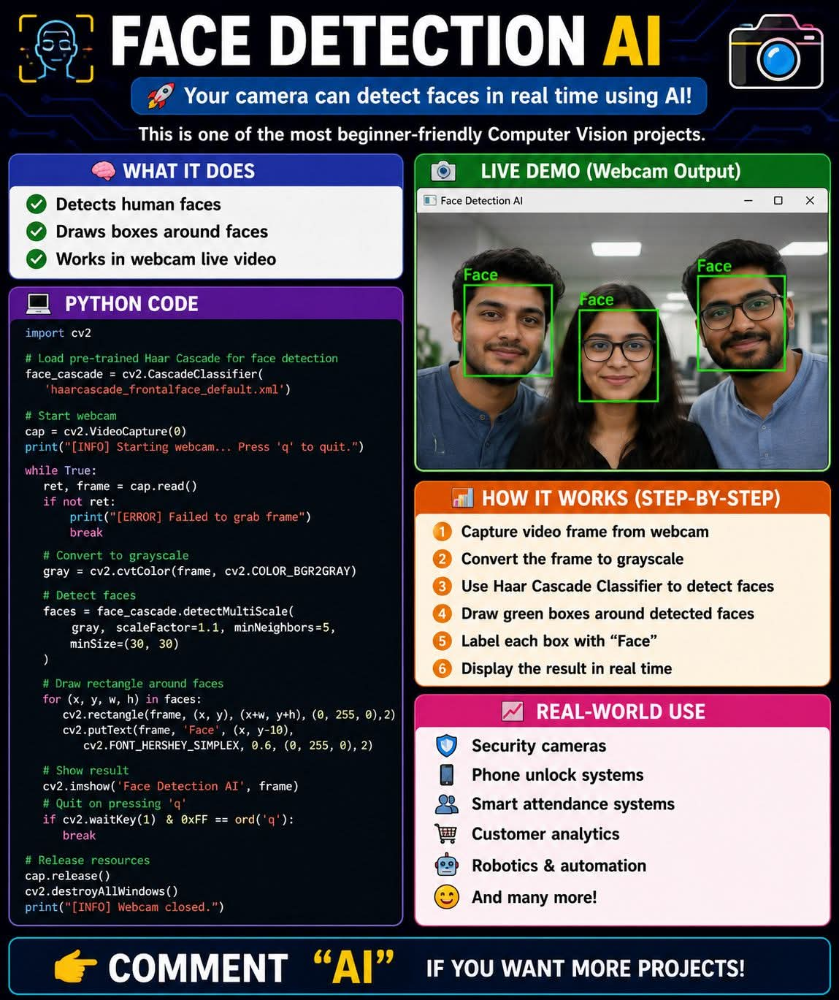

<!-- tags: vinkit, python -->

# Kasvontunnistus-AI Python-koodilla (OpenCV/Haar Cascade)

> Lähde: ulkoinen materiaali (tallennettu sosiaalisesta mediasta), ei sivuston omaa sisältöä.



Kuvassa on esimerkki live-demosta, jossa kolmen henkilön kasvot on tunnistettu webkamerakuvasta ja merkitty vihreillä laatikoilla ("Face"). Tämä on yksi suosituimmista aloittelijaystävällisistä konenäköprojekteista.

## Mitä ohjelma tekee

- Tunnistaa ihmisen kasvot
- Piirtää laatikot kasvojen ympärille
- Toimii reaaliaikaisessa webkameravideossa

## Python-koodi

```python
import cv2

# Load pre-trained Haar Cascade for face detection
face_cascade = cv2.CascadeClassifier(
    'haarcascade_frontalface_default.xml')

# Start webcam
cap = cv2.VideoCapture(0)
print("[INFO] Starting webcam... Press 'q' to quit.")

while True:
    ret, frame = cap.read()
    if not ret:
        print("[ERROR] Failed to grab frame")
        break

    # Convert to grayscale
    gray = cv2.cvtColor(frame, cv2.COLOR_BGR2GRAY)

    # Detect faces
    faces = face_cascade.detectMultiScale(
        gray, scaleFactor=1.1, minNeighbors=5,
        minSize=(30, 30)
    )

    # Draw rectangle around faces
    for (x, y, w, h) in faces:
        cv2.rectangle(frame, (x, y), (x+w, y+h), (0, 255, 0), 2)
        cv2.putText(frame, 'Face', (x, y-10),
                    cv2.FONT_HERSHEY_SIMPLEX, 0.6, (0, 255, 0), 2)

    # Show result
    cv2.imshow('Face Detection AI', frame)
    # Quit on pressing 'q'
    if cv2.waitKey(1) & 0xFF == ord('q'):
        break

# Release resources
cap.release()
cv2.destroyAllWindows()
print("[INFO] Webcam closed.")
```

## Miten se toimii vaiheittain

1. Otetaan videokehys (frame) webkamerasta.
2. Muunnetaan kehys harmaasävyiseksi.
3. Käytetään Haar Cascade -luokitinta kasvojen tunnistamiseen.
4. Piirretään vihreät laatikot tunnistettujen kasvojen ympärille.
5. Merkitään jokainen laatikko tekstillä "Face".
6. Näytetään tulos reaaliajassa.

## Käyttökohteita oikeassa maailmassa

- Turvakamerat
- Puhelimen lukituksen avaus
- Älykkäät läsnäolonseurantajärjestelmät
- Asiakasanalytiikka
- Robotiikka ja automaatio
- ja monta muuta käyttökohdetta

`cv2.CascadeClassifier` lataa valmiiksi koulutetun Haar Cascade -mallin (`haarcascade_frontalface_default.xml`), joka on osa OpenCV:tä. `detectMultiScale`-metodi etsii kasvot kuvasta eri skaaloissa (`scaleFactor`) ja hylkää vääriä positiivisia tuloksia `minNeighbors`-parametrin avulla.
